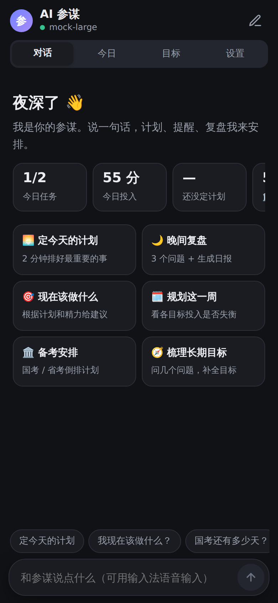
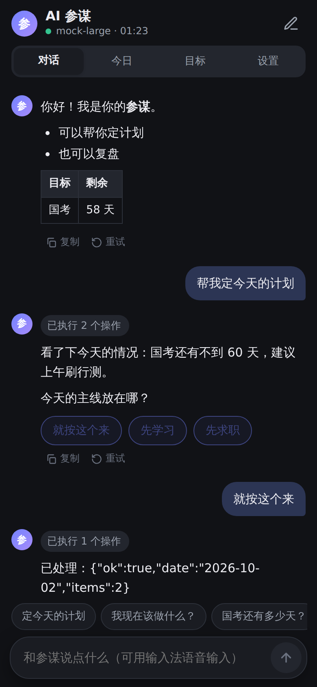
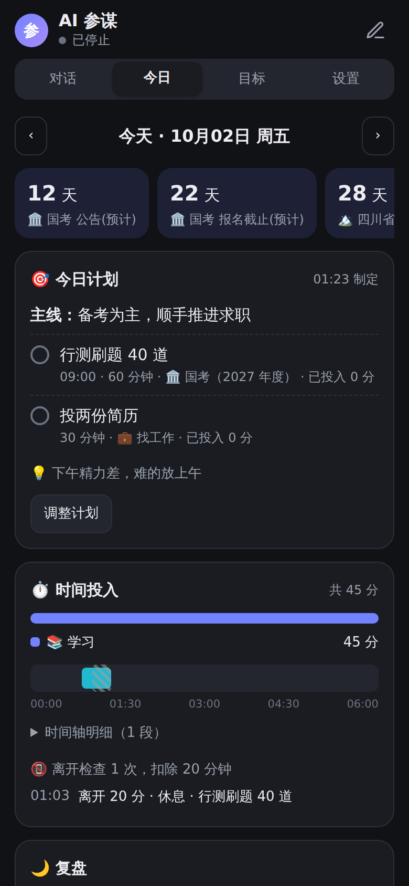
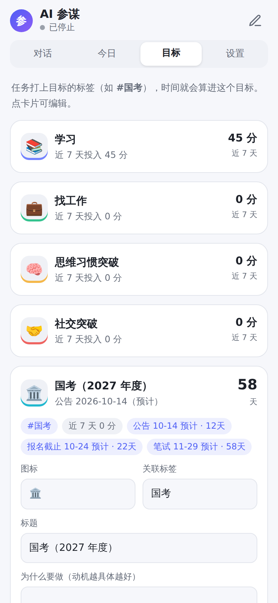

# AI 参谋：Super Productivity 手机端插件

在 Super Productivity（SP）里放一个**会主动盯进度的 AI 参谋**，主要面向安卓 / iOS 客户端：

- **张嘴就能定计划**：说一句“帮我定今天的计划”，参谋会先看今天的数据，再用可以一点就答的选项问你一两个问题，然后把计划写进 SP
- **到点提醒、晚间复盘**：早上提醒你定计划，晚上提醒你复盘；复盘后自动生成日报，写进 SP
- **长期目标 + 考试倒计时**：学习、找工作、思维习惯突破、社交突破，以及国考和四川省考
- **离开检查**：计时中切到别的 App，回来时问你“这段时间在工作还是休息”，休息的时间会从任务里扣掉
- **时间轴**：记录每段计时的起止时间，“今日”页按目标画出当天时间花在哪儿

安装包：[`dist/sp-ai-assistant-0.3.0.zip`](dist/sp-ai-assistant-0.3.0.zip)（插件 id 不变，可以直接覆盖安装 0.2.0，已有的模型配置和对话会保留）

| 对话 | 定计划 | 今日 | 目标 |
|---|---|---|---|
|  |  |  |  |

---

## 四个页面

**对话**：界面参考 ChatGPT / 豆包。
- 回复逐字显示，前提是服务商允许浏览器直连；不允许时自动改为一次性返回
- 停止按钮按下立刻生效，不会再卡住
- 参谋执行的操作折叠成一行“已执行 3 个操作”，点开能看每一步
- 需要你做选择时直接给按钮，点一下就行，少打字
- 删除任务时会在对话里弹出确认卡片

**今日**：今天的计划和勾选状态、各目标的时间投入、时间轴、离开检查记录、复盘内容。也可以复制日报，或手动写入 SP。左右箭头可以翻看前几天。

**目标**：每个目标对应一个 SP 标签，例如 `#国考`。任务打上这个标签，时间就算进这个目标。卡片显示倒计时和近 7 天投入，点开可以编辑动机、本周重点、关键日期和里程碑。

**设置**：选服务商、填 Key、测试连接；配置远程 MCP；设置参谋的节奏（几点定计划、几点复盘、离开多久算离开）。

## 主动提醒是怎么做到的

插件带一个后台脚本 `plugin.js`。只要 SP 开着，它就在后台运行：

| 功能 | 做法 | 耗 token |
|---|---|---|
| 打开 App 时的提示 | 过了早上时间还没定计划，或过了晚上时间还没复盘，打开 SP 时会弹窗。点“开始”直接进入对话 | 否 |
| App 关着也能收到通知 | 维护一个「🧭 参谋」任务，并给它设 SP 的任务提醒。SP 的提醒由安卓原生闹钟触发 | 否 |
| 任务提醒 | 你说“明天 9 点提醒我背单词”，参谋会给任务设提醒时间 | 只有这句对话本身 |
| 离开检查 | 回到前台时，比较离开前后各任务的计时，找出离开期间一直在计时的那个任务，再问你那段时间在干什么 | 否 |
| 时间轴 | 监听“当前任务变化”，记录每段计时的起止时间 | 否 |

只有在对话、定计划或复盘时才调用大模型。

### 省 token 的设计
- 目标、今日计划和长期记忆压缩成十来行，作为“当前情况”放进 system prompt。模型不用每次都调工具去查。
- 只保留最近 10 轮对话；两轮之前的工具结果只留开头 300 字。
- 固定的人设放在提示词最前面，方便 DeepSeek 等服务商的前缀缓存命中。缓存命中的部分价格更低。
- `remember` 工具把你的习惯和偏好记成短句，例如“晚上 10 点后效率低”，以后不用每次重新解释。
- 定计划时用选项提问，最多问 3 轮就给出方案。

## 关于“结合手机 App 使用时长”

**插件做不到。** 读取各 App 的使用时长需要安卓的 `PACKAGE_USAGE_STATS` 系统权限，只有原生 App 能申请。SP 的插件运行在网页环境里，拿不到这个权限。

现在的替代方案是上面的**离开检查**。它不知道你切出去用了哪个 App，但知道你离开了多久、离开时在计哪个任务的时间，并让你一键说明是在工作还是在休息。

以后如果想做得更精细，可以写一个很小的安卓伴侣 App 读取使用时长，再把数据交给插件。这需要单独开发和安装。

## 国考 / 四川省考日期（2026-10-02 估算）

官方公告都还没发布。下面的日期按往年规律估算，**已经预填进“目标”页并标了“预计”**，公告出来后在“目标”页改成官方日期即可，也可以直接告诉参谋。

| 考试 | 公告 | 报名 | 笔试 | 距今 |
|---|---|---|---|---|
| 国考（2027 年度） | 约 10 月 14 日 | 约 10 月 15 日 – 24 日 | 约 **11 月 29 日（周日）** | 约 58 天 |
| 四川省考（2027 年度） | 约 10 月底 | 约 11 月初 | 约 **12 月 6 日（周日）** | 约 65 天 |

依据：
- 国考：近两年都是 10 月中旬发公告、11 月最后一个周末笔试
- 四川：2026 年度省考 2025 年 10 月 29 日发公告，10 月 30 日到 11 月 5 日报名，12 月 6–7 日笔试；2023 年起改为一年一考

## 安装与配置

1. 下载 `dist/sp-ai-assistant-0.3.0.zip`
2. SP → 设置 → 插件 → 上传插件 → 启用
3. 从侧边栏或顶栏的“AI 参谋”进入 → 设置 → 选服务商、填 API Key → 保存并测试
4. 回到“对话”，点“定今天的计划”试试

输入时可以用输入法的**语音输入**（搜狗、讯飞、系统键盘都有麦克风键），这就是“张嘴定计划”。

### 网络通道

插件页面与 SP 同源，所以手机上会借用 SP 主窗口的网络请求，安卓 / iOS 上走原生 HTTP：
- 不受 CORS 限制
- 能访问局域网
- 没有 30 秒限制

只有服务商允许浏览器直连时，才会改用插件页面自己的 `fetch` 来做逐字输出。最后的退路是 `PluginAPI.request`，但它有几个限制：
- 只能访问 manifest 里列出的公网域名
- 单次请求最多 30 秒
- 读不到响应头

需要新增域名时这样重新打包：`node scripts/pack.mjs --host api.example.com`。

### 远程 MCP
在“设置 → 远程 MCP 服务器”里填地址（Streamable HTTP）。插件支持 JSON 和 SSE 两种响应，会带上 `Mcp-Session-Id`，会话过期后自动重连；连不上不影响聊天。如果要在桌面版里通过浏览器 fetch 访问，服务器要显式允许 `Authorization` 请求头，因为 `Access-Control-Allow-Headers: *` 不包括它。

## 数据存在哪

| 内容 | 位置 | 是否同步 |
|---|---|---|
| API Key、模型配置、对话记录 | 本机 localStorage | 否 |
| 目标、长期记忆、每日计划 / 复盘 / 日报、时间轴、节奏设置 | SP 插件数据 | 跟随 SP 自带的同步 |
| 日报全文 | 当天「🧭 参谋：日报 MM-DD」任务的备注 | 是，可在 SP 里搜索 |

## 开发

```
plugin/            插件源码：manifest.json、index.html（界面 + 对话）、plugin.js（后台脚本）、icon.svg
scripts/pack.mjs   压缩（terser）到 dist/build/，再打包成 dist/*.zip
dev/               模拟 SP 宿主 + 模拟大模型（含流式）+ 模拟 MCP 服务器，以及端到端测试
```

SP 规定插件的 `index.html` 不能超过 100 KB（复用了 manifest 的大小上限），所以打包时会压缩代码；超过上限会直接报错，不会生成装不上的包。源码在 `plugin/`，保持可读。

```bash
npm install                           # 装压缩工具 terser
node scripts/pack.mjs                 # 压缩 + 打包
node dev/e2e.mjs                      # 端到端测试（需要 Playwright）；SHOTS=1 会把截图存到 dev/shots/
PORT=8799 node dev/mock-server.mjs    # 手动调试：打开 http://127.0.0.1:8799/harness.html?native=1
```

端到端测试默认测的是压缩后、真正打进安装包的 `dist/build/`，在 Chromium 里跑两种宿主：模拟安卓（原生 HTTP、非流式、深色）和模拟桌面（CORS 直连、流式、浅色）。覆盖的场景有：
- 设置页测试连接、MCP 连接
- Markdown 渲染
- 定计划：先查今日 → 弹出选项 → 点选 → 保存计划，并在 SP 里建出带目标标签和时间的任务
- 带提醒的建任务；删除前在对话里确认
- 调用远程 MCP 工具、长期记忆
- 复盘后日报写进 SP
- 停止按钮立刻生效
- 离开检查扣除时间、时间轴记录、提醒任务维护
- 今日 / 目标页渲染、重开后恢复对话

真机上已验证的只有 0.2.0 的连接部分。0.3.0 的后台脚本（离开检查、到点提示、提醒任务）只在模拟环境里测过，请在手机上留意：
- 离开检查依赖 SP 回到前台时把后台计时补记到任务上，回来后约 3 秒才会弹窗
- 「🧭 参谋」任务的系统通知依赖 SP 的提醒权限，需要在系统设置里允许通知和精确闹钟
