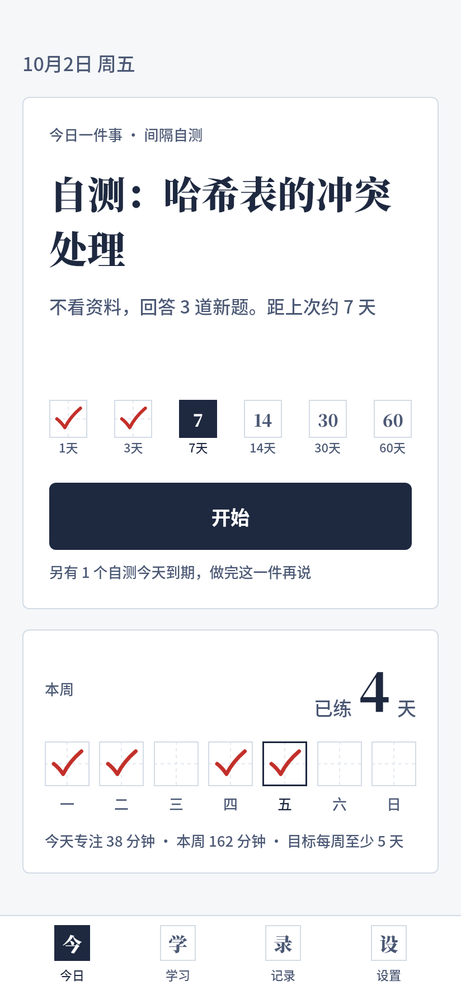
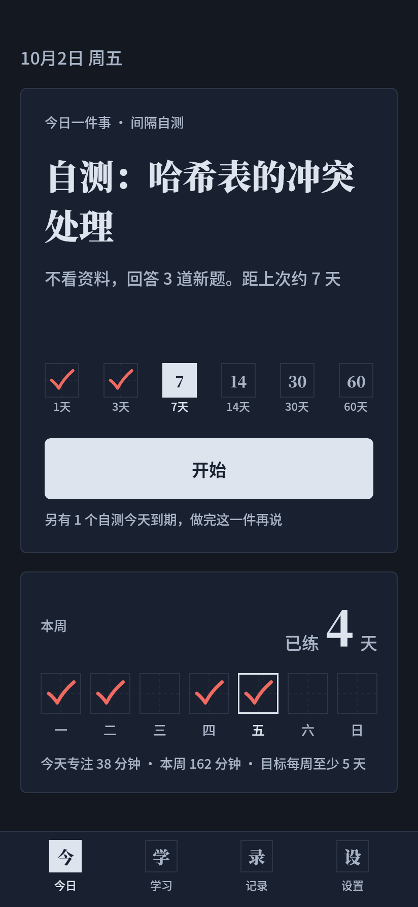
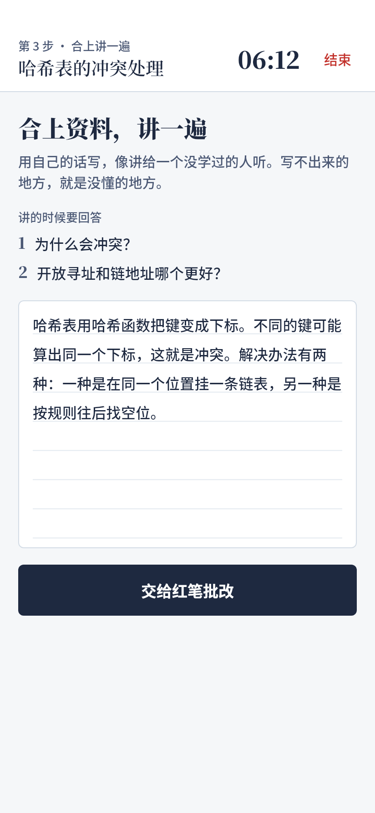
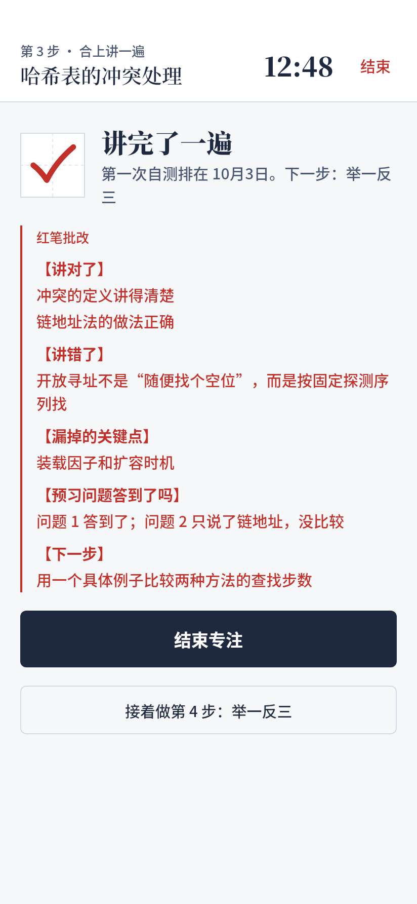
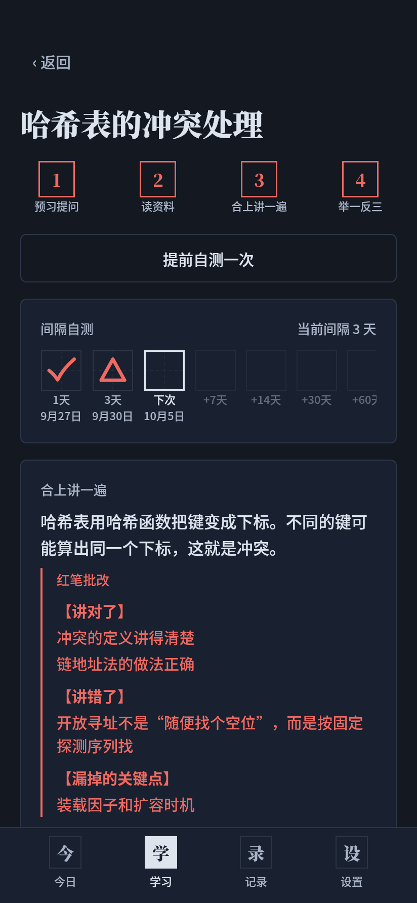

# 行为管理部 App（Android）

需求见 [`docs/PRD.md`](../docs/PRD.md)。当前实现到 **阶段 1**：今日 + 学习 + AI 教练服务 + 提醒 + 事件日志 + 设置。

| 今日 | 今日（深色） | 合上讲一遍 | 红笔批改 | 学习单元（深色） |
|---|---|---|---|---|
|  |  |  |  |  |

截图由同一套 Compose 组件在桌面端离线渲染，正文字体用 Noto Sans SC 代替手机系统字体，真机上会略有差别。

## 拿到 APK

GitHub Actions 每次推送都会构建 debug APK：仓库 → Actions → **Android APK** → 最新一次运行 → Artifacts 里的 `behavior-dept-debug-apk`。解压后把 `app-debug.apk` 传到手机安装（需允许“安装未知应用”）。

本地也可以用 Android Studio 打开 `behavior-app/` 目录直接运行。

## 结构

```
app/src/main/java/com/behaviordept/app/
  today/      今日一件事、专注模式（训练都在专注里完成）
  study/      学习单元四步、间隔规则、步骤格 / 间隔时间线 / 保持率曲线
  record/     事件日志
  settings/   设置、首次引导、权限
  ai/         统一调用层（Anthropic / OpenAI 兼容）、提示词模板、固定格式解析
  reminder/   每日提醒（精确闹钟）、自测到期提醒（WorkManager）
  data/       Room 实体（PRD 数据模型全部 14 个）、DAO、备份、设置存储
  ui/         “练习本”主题和组件
```

字体：`res/font` 里的思源宋体按 GB2312 常用字裁剪（每个字重约 2.5 MB），生僻字自动回落到系统字体。
