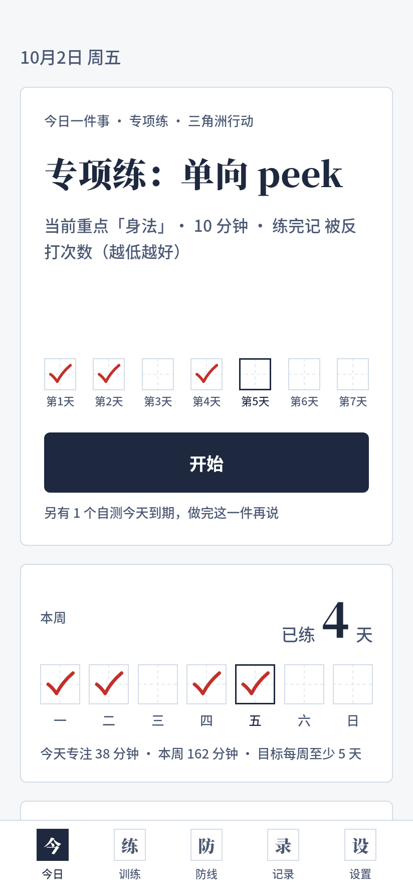
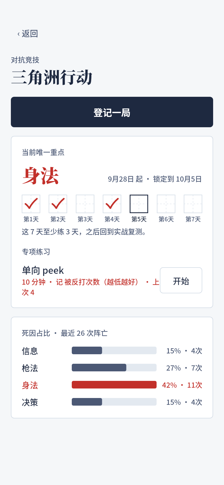
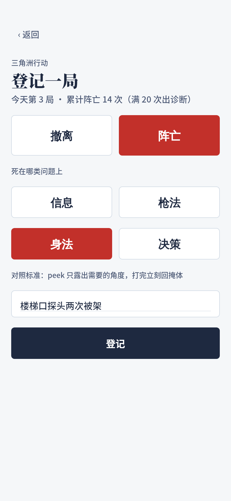
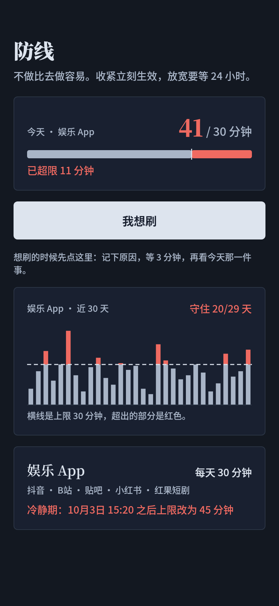
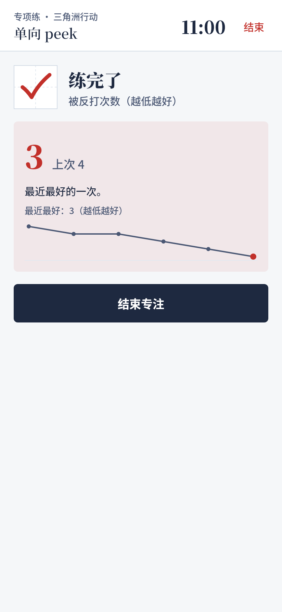

# 行为管理部 App（Android）

需求见 [`docs/PRD.md`](../docs/PRD.md)（v2）。当前版本 0.2.0：

- **今日**：唯一的下一步（到期自测 → 学习单元 → 实战复测 → 当前短板专项练 → 新建），一键进入专注
- **训练**：通用引擎——标准 → 诊断 → 当前唯一重点（锁 7 天）→ 专项练（当场对比以往数字）→ 实战复测；内置 **三角洲行动**、**考公**，可自建动作技能；学习单元也在这里
- **防线**：自动读取抖音 / B站 / 贴吧 / 小红书 / 红果短剧用时，规则放宽有 24 小时冷静期，“我想刷”先等 3 分钟
- **记录**：四个成功指标、训练热力图、折腾 vs 训练、周复盘（AI 分析，确认下周唯一重点）
- 桌面长按图标：“我想刷”“登记一局”

| 今日 | 今日 · 专项练 | 技能：当前重点 + 死因诊断 | 登记一局 | 防线（深色） |
|---|---|---|---|---|
|  |  |  |  |  |

| 专项练反馈 | 合上讲一遍 | 红笔批改 | 学习单元（深色） | 今日（深色） |
|---|---|---|---|---|
|  |  |  |  |  |

截图由同一套 Compose 组件在桌面端离线渲染（部分页面用组件拼的样例数据），正文字体用 Noto Sans SC 代替手机系统字体，真机上会略有差别。

## 拿到 APK

GitHub Actions 每次推送都会构建 debug APK：仓库 → Actions → **Android APK** → 最新一次运行 → Artifacts 里的 `behavior-dept-debug-apk`。解压后把 `app-debug.apk` 传到手机安装（需允许“安装未知应用”）。

本地也可以用 Android Studio 打开 `behavior-app/` 目录直接运行。

## 结构

```
app/src/main/java/com/behaviordept/app/
  today/      今日一件事、专注模式（学习在专注里完成）
  training/   训练引擎：诊断、重点锁定、复测、内置技能、对局 / 考试登记、专项练
  guard/      防线：规则冷静期、用时读取、我想刷
  study/      学习单元四步、间隔规则、步骤格 / 间隔时间线 / 保持率曲线
  record/     看板指标、热力图、事件日志、周复盘
  settings/   设置、首次引导、权限
  ai/         统一调用层（Anthropic / OpenAI 兼容）、提示词模板、固定格式解析
  reminder/   每日提醒（精确闹钟）、自测到期提醒、用时同步与超限提醒（WorkManager）
  data/       Room 实体（16 张表）、v1→v2 迁移、DAO、仓库、备份、设置存储
  ui/         “练习本”主题和组件
```

字体：`res/font` 里的思源宋体按 GB2312 常用字裁剪（每个字重约 2.5 MB），生僻字自动回落到系统字体。
