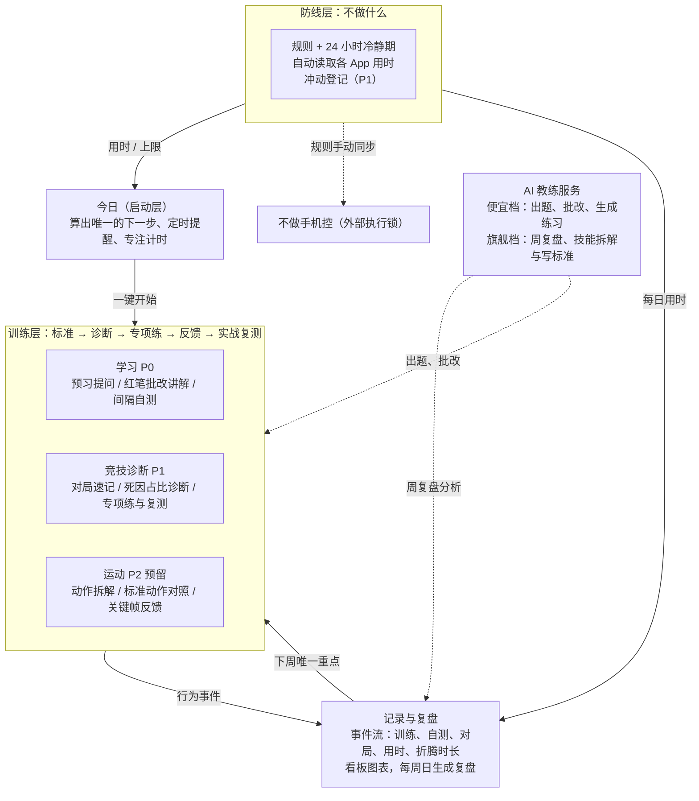

# 行为管理部 App 产品需求文档 v1

版本：v2，2026-10-02（v1：2026-10-01）。放在仓库 `docs/PRD.md`，开发以本文档为准。v2 的变化见文末“v2 决策”。

## 产品定位

行为管理部 App 是装在手机上的私人教练：替你决定下一步练什么，记录你实际做了什么，并在你想做不该做的事时设障碍。它的产出是行为变化，输入是行为记录。

**在四部门里的位置。** 谋划思考部负责想清楚，信息收集部提供标准和资料，统筹规划部安排时间。行为管理部是唯一检查"真的做了没有、做得对不对"的部门。

**要解决的四个问题：**

1. 光看不练：只有输入，没有输出，得到的是"看懂了"的感觉。
2. 傻练：有输出，但没有标准和反馈，只是在重复现有水平。
3. 启动难：知道该做，但切换不进状态。
4. 管不住：不该做的事停不下来。

**用户只有一个人：你。** 不考虑多用户、社交和商业化。

**明确不做：**

- 不做手机锁。锁由不做手机控执行，本 App 只读数据、展示规则。
- 不做通用笔记。知识沉淀留在艾玛笔记。
- 不提供空白聊天框。AI 只在流程节点出现，避免变成又一个聊天入口。
- v1 不做视频动作分析，运动模块后置。

**四周后的成功标准（建议值）：**

| 指标 | 目标 |
| --- | --- |
| 每周训练天数 | ≥ 5 天 |
| 间隔自测按时完成率 | ≥ 70% |
| 娱乐 App 未超 30 分钟的天数占比 | ≥ 80% |
| 折腾系统时间 : 实际训练时间 | ≤ 1 : 4 |

## 设计原则

这七条是硬约束。任何功能与它们冲突，以原则为准。

1. **启动不靠意志力。** 打开 App 永远只看到一件事和一个按钮。下一步由系统提前算好，你只负责点开始。
2. **记录行为，不记录感受。** 判断依据是作答结果、对局登记和自动读取的用时，而不是"今天状态如何"的自评。
3. **不做比去做容易，防线优先加码。** 对"不该做"的约束比对"该做"的催促更硬，例如放宽规则必须等冷静期。
4. **先有标准，再有练习。** 每个技能先写出"好的样子"，必须能被观察到。没有标准的项目不能开始训练。
5. **一次只练一个短板。** 诊断后系统只给一个当前重点，复测通过之前不换。
6. **反馈当场给。** 每次练习结束立刻有批改或数据对比，拆开练的东西必须回到实战里复测。
7. **App 不能成为新的逃避。** 配置项极少；App 单独统计"折腾系统的时间"，并和训练时间并排展示。

## 系统总架构

今日是唯一入口，训练层和防线层负责执行，记录与复盘把数据变成下一周的重点，AI 服务只在节点上被调用。



实线是行为和数据的流向，虚线是外部工具或 AI 调用。训练层的三个模板共用一套引擎：标准 → 诊断 → 专项练 → 反馈 → 实战复测。以后新增一个领域，只加模板，不改架构。

## 模块详细需求

共八个模块。P0 是第一版必须有，P1 是第二批，P2 视使用情况再定。

### M1 今日（启动层）

目标：打开 App 三秒内知道做什么，两次点击内开始。

| 功能 | 说明 | 优先级 |
| --- | --- | --- |
| 今日一件事 | 按顺序算出唯一的下一步：到期自测 → 进行中单元的下一步 → 当前短板专项练 → 新建。只显示一个主按钮 | P0 |
| 专注模式 | 点开始后进入全屏：当前任务、计时、结束按钮。结束自动写入记录 | P0 |
| 本周田字格 | 7 个格子，当天有任何训练就打红勾 | P0 |
| 防线状态条 | 今日娱乐用时 / 上限的进度条，超限变红 | P1 |
| 定时提醒 | 每天固定时间推送通知，点通知直达今日一件事 | P0 |
| 桌面小组件 | 显示今日一件事，点击直接开始 | P2 |

验收：冷启动到开始训练不超过 2 次点击，过程中没有任何需要自己做的选择。

### M2 学习模块（训练层模板一）

目标：把"看懂了"变成"能讲出来、隔几天还能答出来"。

| 功能 | 说明 | 优先级 |
| --- | --- | --- |
| 学习单元 | 标题 + 资料（粘贴文本）。一个单元是一次学得完的一小块 | P0 |
| 预习提问 | 看资料前写 2–3 个问题 | P0 |
| 合上讲一遍 | 用自己的话写讲解，AI 红笔批改：讲对的、讲错的、漏掉的、预习问题答到没有 | P0 |
| 间隔自测 | 间隔 1/3/7/14/30/60 天。AI 每次出新题，不看资料作答，AI 批改后自己判定记得 / 模糊 / 忘了 | P0 |
| 举一反三 | 找一个表面不同、底层相同的例子，AI 判断类比在哪一层成立、哪一层失效 | P0 |
| 拍照导入资料 | 拍书页或屏幕，OCR 转文本 | P1 |
| 知识地图 | 单元之间的关联图 | P2 |
| 导出 Markdown | 单元讲解和批改导出到艾玛笔记 | P1 |

间隔规则：判定"记得"间隔升一级；"模糊"间隔不变；"忘了"回到 1 天。讲完一遍后第一次自测在第二天。

验收：一个单元能完整走完四步；到期自测自动出现在今日一件事。

### M3 竞技诊断模块（训练层模板二，以三角洲行动为首个项目）

目标：从"凭感觉打"变成"知道自己死在哪类问题上，并专门练那一类"。

| 功能 | 说明 | 优先级 |
| --- | --- | --- |
| 技能树与标准 | 四个大类：信息、枪法、身法、决策（含配装和撤离判断）。每个子项写一句可观察的标准，例如"拐角前准星已在头线高度" | P1 |
| 对局速记 | 每局结束 30 秒内登记：撤离或阵亡；阵亡就点选死因大类 + 一句话 | P1 |
| 短板诊断 | 累计 20 次阵亡后，按死因占比画图，占比最高的一类设为当前重点 | P1 |
| 专项练习库 | 每个大类 2–3 个练习，由 AI 按标准生成、你确认后固定，例如每次交火前说出"打 / 不打 + 理由" | P1 |
| 实战复测 | 练满 7 天后，对比该类死因占比变化，决定继续练还是换短板 | P1 |

验收：登记一局不超过 30 秒；诊断图随登记自动更新。

### M4 运动模块（训练层模板三，预留）

只定义框架，v1 不实现：动作拆解 → 标准动作参考 → 自拍关键帧对照 → AI 看图反馈。羽毛球、篮球上篮都走这个模板。优先级 P2。

### M5 防线（不做什么）

目标：让"不做"有数据、有障碍、改规则有代价。

| 功能 | 说明 | 优先级 |
| --- | --- | --- |
| 规则清单 | 例如"抖音 + B站 + 贴吧 每日合计 30 分钟"。规则在本 App 定义和展示 | P0 |
| 用时自动读取 | 通过 Android 使用情况访问权限读取各 App 每日用时，自动对照规则 | P0 |
| 规则冷静期 | 收紧立即生效；放宽要等 24 小时才生效，期间可撤回 | P0 |
| 冲动登记 | 桌面按钮"我想刷"：记下时间和原因（无聊 / 逃避 / 累），倒数 3 分钟，同时给出今日一件事 | P1 |
| 执行锁 | 不在本 App 实现，由不做手机控执行；本 App 提示规则需在那边同步设置 | — |

验收：每天的娱乐用时与上限对比自动生成，不需要手动输入。

### M6 记录与复盘

目标：所有判断都有数据底，复盘不用手动整理。

| 功能 | 说明 | 优先级 |
| --- | --- | --- |
| 事件日志 | 自动记录所有训练、自测、对局登记、专注时长、娱乐用时、App 内设置页停留时长 | P0 |
| 数据看板 | 热力图、保持率曲线、死因分布、用时对上限、折腾 vs 训练（见视觉规范） | P0 |
| 周复盘 | 每周日晚生成：数据摘要 + 旗舰模型分析"本周断在哪、下周唯一重点"。你确认后写入当前重点 | P1 |
| 导出复盘 | 复盘文本一键复制，给其他部门或 Claude 使用 | P0 |

验收：周复盘里的每个数字都来自日志，无需手填。

### M7 AI 教练服务（后台）

目标：AI 只在流程节点出现，便宜任务用便宜模型。

| 功能 | 说明 | 优先级 |
| --- | --- | --- |
| 统一调用层 | 同时支持 Anthropic 接口和 OpenAI 兼容接口 | P0 |
| 任务分档 | 便宜档：出题、批改、死因归类建议、生成练习。旗舰档：周复盘、技能拆解与标准制定 | P0 |
| 提示词模板 | 集中管理，带版本号，输出格式固定 | P0 |
| 成本控制 | 每日调用上限；显示本月估算花费 | P1 |
| 离线降级 | 无网或无额度时，学习模块切换为对照资料自查 | P0 |

固定输出格式：

- 讲解批改：按【讲对了】【讲错了】【漏掉的关键点】【预习问题答到了吗】【下一步】分段，每段 1–4 条短句。
- 出自测题：只输出 JSON 字符串数组，3 道题，至少 1 道问"为什么"，至少 1 道要求用到新情境。
- 自测批改：每题【第 N 题】✓ / △ / ✗ + 一句话，最后【建议】记得 / 模糊 / 忘了 + 理由。
- 举一反三：【成立的地方】【不成立的地方】【再远一点】（只给例子不给解释）。

### M8 设置

API Key、模型档位、提醒时间、规则、数据导出与导入。设置页停留超过 10 分钟时提示回到训练，这段时间计入"折腾系统时间"。优先级 P0。

## 数据模型

核心是一张通用的技能表加一条事件流：学习、竞技、运动都是"技能 + 模板"，所有行为都落成事件。

| 实体 | 关键字段 | 说明 |
| --- | --- | --- |
| Skill 技能 | id、名称、模板类型（learning / competitive / motor）、当前重点子项 id | 一个要提升的领域，例如"三角洲行动""数据结构" |
| SubSkill 子能力 | id、skillId、名称、标准描述、状态（未开始 / 练习中 / 已通过） | 拆解出来的单项，标准必须可观察 |
| Drill 练习 | id、subSkillId、做法、时长（分钟）、来源（AI 生成 / 手写） | 专项练习方案，确认后固定 |
| StudyUnit 学习单元 | id、skillId、标题、资料、预习问题、讲解、批改、学完时间、讲完时间、间隔等级、下次自测时间 | 学习模板的核心对象 |
| Review 自测 | id、unitId、题目、作答、AI 批改、自评（记得 / 模糊 / 忘了）、时间 | 一次间隔自测 |
| Transfer 举一反三 | id、unitId、例子、AI 点评、时间 | |
| MatchLog 对局 | id、skillId、时间、结果（撤离 / 阵亡）、死因大类、一句话 | 竞技模板的诊断数据 |
| Session 训练时段 | id、类型、关联对象 id、开始、结束 | 专注模式产生 |
| Rule 规则 | id、App 包名列表、每日上限（分钟）、生效时间、待生效的放宽值 | 冷静期靠"待生效"字段实现 |
| UsageDay 用时 | 日期、包名、分钟 | 每天从系统读取一次 |
| UrgeLog 冲动 | id、时间、原因、之后是否开始了训练 | P1 |
| Event 事件 | id、时间、类型、关联 id、数值 | 所有图表和复盘的唯一数据源 |
| WeeklyReview 周复盘 | 周起始日、数据摘要、AI 分析、确认的下周重点 | |
| AiCall 调用 | 时间、任务类型、模型、输入输出 token、估算费用 | 成本统计用 |

## 视觉与可视化规范

设计语言叫"练习本"：田字格、横格纸、蓝黑墨水、老师的红笔。红色只留给反馈和完成标记，其余全部克制。

**色彩（浅色 / 深色）：**

| 名称 | 浅色 | 深色 | 用途 |
| --- | --- | --- | --- |
| 纸 | #F5F7F9 | #131821 | 页面背景 |
| 页面 | #FFFFFF | #192030 | 书写区、卡片 |
| 格线 | #E3E9F0 | #232C3A | 田字格、横格 |
| 分隔线 | #D3DCE6 | #2C3646 | 区块分隔 |
| 墨水 | #1E2940 | #DDE4EE | 正文、主按钮 |
| 次墨水 | #4B5874 | #A9B5C7 | 次要文字 |
| 红笔 | #C2302A | #EF6A61 | 批改、勾、超限 |

**字体：** 标题和数字用思源宋体（Noto Serif SC）600 / 900，打包进 App；正文用系统无衬线。数字是主角时用宋体大字，例如"已练 5 天"。

**标志性组件：**

- 今日一件事卡：大号宋体标题 + 一句说明 + 一个墨水色按钮，占首屏上半部分。
- 田字格打卡：每格带浅色十字线，完成后写入红色宋体"✓"。
- 红笔批改块：左侧 2dp 红线，红色文字，【小标题】加粗。
- 横格书写区：输入框背景是 32dp 行距横线，文字压在线上。
- 步骤格：方框数字，已完成红框、当前墨水实底、未开始灰框。

**每个页面的核心图表：**

| 页面 | 图表 | 回答的问题 |
| --- | --- | --- |
| 今日 | 本周田字格 + 娱乐用时进度条 | 这周练了几天？今天还剩多少娱乐额度？ |
| 学习单元 | 间隔时间线：每次自测是一个格，标 ✓ △ ✗，下次自测位置高亮 | 这块内容记牢了没有？ |
| 学习总览 | 保持率曲线：横轴间隔天数，纵轴"记得"占比 | 我的记忆在第几天开始掉？ |
| 竞技诊断 | 死因占比横条图，当前重点那一条用红色 | 我最常死在哪类问题上？ |
| 竞技复测 | 当前短板死因占比的周折线 | 练了之后这一类变少了吗？ |
| 防线 | 30 天娱乐用时柱状图 + 30 分钟上限横线，超出部分红色 | 规则守住了几天？ |
| 记录 | 30 天训练分钟热力图（田字格样式） | 我的训练是连续的还是断断续续的？ |
| 记录 | 折腾系统 vs 实际训练的每周对比条 | 我是在练，还是在搭系统？ |

**动效：** 只在完成动作时出现，例如打勾时红笔描一笔。尊重系统的减少动态效果设置。深色模式必须完整支持。

## 技术方案

做原生 Android App：Kotlin + Jetpack Compose，数据全部存在手机本地。原因是防线模块要读其他 App 的用时，网页和 PWA 都做不到，通知也不稳定。

| 项 | 选型 | 说明 |
| --- | --- | --- |
| 平台 | Android 10 及以上（minSdk 29） | 不做手机控、Operit 都在 Android 上 |
| 界面 | Jetpack Compose + Material 3，自定义主题 | 按视觉规范的色彩和组件实现，不用默认紫色主题 |
| 本地数据库 | Room | 事件流和所有实体 |
| 设置存储 | DataStore；API Key 用加密存储 | Key 不写进代码、不进日志 |
| 定时提醒 | WorkManager + 精确闹钟 | 每日提醒、自测到期提醒、周日复盘 |
| 用时读取 | UsageStatsManager | 需要用户手动开启"使用情况访问权限" |
| 图表 | Vico（Compose 图表库），田字格和热力图手绘 Canvas | 田字格风格默认库画不出来 |
| 网络 | OkHttp + kotlinx.serialization | 调 AI 接口 |
| 架构 | 单 Activity，MVVM，按模块分包 | today / study / competitive / guard / record / ai / settings |
| 备份 | 导出 / 导入 JSON 文件 | v1 不做云同步 |
| 构建与安装 | GitHub Actions 在云端构建 debug APK，作为 Artifact 下载后直接装到手机 | 本地环境无法访问 Google Maven 仓库，不依赖本地编译；不上应用商店 |

**AI 模型分档：**

| 档位 | 任务 | 模型示例 | 频率 |
| --- | --- | --- | --- |
| 便宜档 | 出自测题、批改讲解和作答、生成练习、死因归类建议 | Claude Haiku 4.5，或任一 OpenAI 兼容的低价模型 | 每天数次 |
| 旗舰档 | 周复盘、技能拆解与写标准 | Claude Opus / Sonnet | 每周 1–3 次 |

所有 AI 输出要求固定格式（见 M7），解析失败时提示重试，不静默吞掉。模型名和接口地址在设置里可改，不写死。

**需要的系统权限：** 通知、精确闹钟、使用情况访问。首次打开时用一页引导逐个开启，拒绝也能用，只是对应功能隐藏。

## 开发路线与 Claude Code 任务说明

分五个阶段做，每个阶段过了关卡才开下一个。现在只开工阶段 0 和阶段 1。

1. **阶段 0：工程骨架** —— 包结构、主题与深色模式、数据模型一节的全部实体、底部导航，空页面可运行，GitHub Actions 工作流可产出 APK。
    - 关卡：APK 装上手机，深浅色都正确。
2. **阶段 1：今日 + 学习 + AI 服务 + 提醒** —— 四步学习流程、红笔批改、间隔自测、举一反三；专注计时、每日提醒、事件日志、设置。
    - **关卡（最关键）：自己用满 7 天，至少 5 天打勾。**
3. **阶段 2：防线 + 数据看板** —— 规则与冷静期、用时自动读取；热力图、用时对上限、折腾对训练。
    - 关卡：连续 7 天自动生成用时数据。
4. **阶段 3：周复盘 + 竞技诊断** —— 旗舰模型周复盘、确认下周重点；三角洲对局速记、死因诊断、专项练。
    - 关卡：完成 2 次周复盘，阵亡登记满 20 次。
5. **阶段 4：按使用情况再定** —— 运动模板、冲动登记、知识地图、拍照导入。只做前三阶段数据证明需要的。

关卡卡的是"用"而不是"做完"：阶段 1 做完但没用满 7 天，就不开阶段 2。这是原则 7 在开发流程里的落地。

**交给 Claude Code 的方法：**

1. 本文件放进仓库的 `docs/PRD.md`。
2. 每个阶段开一个新会话，用下面的提示词开头，只做当前阶段。
3. 做完先让 Claude Code 对照验收条件自查，再从 GitHub Actions 下载 APK 装到手机上实测。

**阶段 1 提示词模板：**

```
你是这个 Android 项目的开发者。先完整阅读 docs/PRD.md。
本次只实现「阶段 1」：M1 今日（P0 部分）、M2 学习模块（P0）、M7 AI 教练服务（P0）、M8 设置、M6 的事件日志。
硬性要求：
- 严格按 PRD「技术方案」的选型，不自行换库。
- 界面严格按「视觉与可视化规范」的色彩、字体和组件实现，完整支持深色模式。
- API Key 用加密存储，不写进代码和日志。
- AI 输出按 PRD M7 规定的固定格式解析，失败时显示可重试的提示。
- 不实现本阶段以外的功能，也不留空壳页面。
- 本地无法访问 Google Maven 仓库，不要尝试本地编译；保证 GitHub Actions 工作流能构建出 debug APK。
完成后：逐条对照 PRD 验收条件说明完成情况，列出我要在手机上手动测试的步骤。
```

阶段 0 用同一模板，把"本次只实现"改成：工程骨架、主题与深色模式、数据模型一节的全部实体、底部导航、GitHub Actions 构建工作流。

## 待决问题（v2 已定）

- [x] 手机是 Android：用时读取按 UsageStatsManager 实现。
- [x] 模型：便宜档默认 `claude-haiku-4-5`，旗舰档默认 `claude-opus-5-5`，设置里可改；也可以接任意 OpenAI 兼容接口（包括 Gemini 的兼容接口）。
- [x] 先练的两条线：**三角洲行动** 和 **考公**。学习单元继续保留。
- [x] 提醒时间默认 08:30，设置里可改。
- [x] 放宽规则的冷静期：24 小时。
- [x] 每次登记愿意花 30 秒到 2 分钟：对局速记 ≤ 30 秒，考试登记 ≤ 2 分钟。
- [x] 实战复测：模考、真题、真考都算考公的实战。
- [x] 动作类（羽毛球、上篮）的动作分析交给 Gemini 实时看，App 负责标准、练习、记录和复测，分析结果可以粘贴进记录。
- [x] 防线管的 App：抖音、B站、贴吧、小红书、红果短剧（主要耗时的是小红书），默认合计每天 30 分钟。
- [ ] 以后需要和电脑端同步数据吗？需要的话要加云端（现在用 JSON 导出导入）。

## v2 决策

v2 把“学习专用”改成**通用训练引擎 + 模板**，并提前做了防线、看板和周复盘。

**通用训练引擎（所有模板共用）：**

1. 技能 → 子能力，每个子能力写 3–5 条**能被观察到**的标准（可以让旗舰模型拆，也可以手写）。
2. 诊断：对抗竞技看最近 50 次阵亡的死因占比（满 20 次才给结论）；考试看最近 3 次考试各模块的丢题占比；动作技能自己选。
3. **当前唯一重点**：设定后锁定 7 天，锁定期内不能换（原则 5）。
4. 专项练：在专注模式里做，练完记一个数字，当场和上次、最好成绩、最近走势对比（原则 6）。练习可以由便宜模型按标准生成，确认后才固定。
5. 实战复测：7 天里至少练 3 天后进入复测。对抗竞技再登记 10 次阵亡，对比该类死因占比；考试再登记一次考试，对比该模块正确率（申论看分数）；动作技能实战一次，逐条对照标准记达标比例。
6. 复测有结果后自己决定：继续练这一项（重新计 7 天），或通过、换下一个短板。

**今日一件事的顺序：** 到期自测 → 学习单元下一步 → 实战复测 → 当前短板专项练（今天还没练时）→ 新建学习单元。

**模板：**

| 模板 | 子能力 | 实战数据 | 登记用时 |
| --- | --- | --- | --- |
| 对抗竞技（三角洲） | 信息 / 枪法 / 身法 / 决策（内置标准和练习） | 每局：撤离或阵亡 + 死因大类 + 一句话 | ≤ 30 秒，桌面快捷方式“登记一局” |
| 考试（考公） | 常识 / 言语 / 数量 / 判断 / 资料 / 申论（内置标准和练习） | 每次考试：各模块对几题 / 共几题 / 用时 / 主要丢分原因，行测和申论分数 | ≤ 2 分钟 |
| 动作技能（自建） | AI 拆或手写 | 实战复测时逐条对照标准；可粘贴 Gemini 的分析 | — |
| 学习 | 学习单元四步 | 间隔自测 | — |

**防线：** 规则在 App 里定义；收紧立即生效，放宽（提高上限、少管一个 App、删除规则）等 24 小时，期间可撤回。用时每小时自动从系统读取一次。“我想刷”：记原因（无聊 / 逃避 / 累）→ 倒数 3 分钟 → 给出今日一件事，记录之后是否转去训练。超限时提醒一次。执行锁仍由不做手机控负责。

**记录与周复盘：** 记录页显示四个成功标准（本周训练天数、近 4 周自测按时率、近 4 周娱乐守住天数占比、本周折腾 : 训练）、5 周训练热力图、每周折腾 vs 训练。周复盘的数据摘要全部从日志生成，旗舰模型只分析“断在哪、下周唯一重点”，确认后保存，可一键复制给其他部门或 Claude。周日 20:00 后提醒一次。

**底部导航：** 今日 / 训练 / 防线 / 记录 / 设置。学习单元在“训练”里。

**数据：** 数据库升级到 v2：新增考试登记两张表，技能、练习、规则、自测加了几列；升级时保留全部 v1 数据（有自动化测试覆盖）。
