# 脉络 · 知识结构引擎 v0.1

把零散的笔记和 AI 回复拆成「**体系 → 层级 → 节点 → 关系**」。提问时只把相关的子结构发给 AI（路径、节点、一跳邻居、激活词），用最少的 token 把 AI 引到正确的知识区。属于四部门系统中的**谋划思考部**。

**结构由你决定，AI 只负责提议。** AI 拆出的节点和关系都要你逐张确认才会写入。推断类节点必须标「把握」和「验证方式」，避免把听起来合理的说法当成规则。

| 今日 | 结构 | 候选卡片 | 节点与关系 |
|---|---|---|---|
| 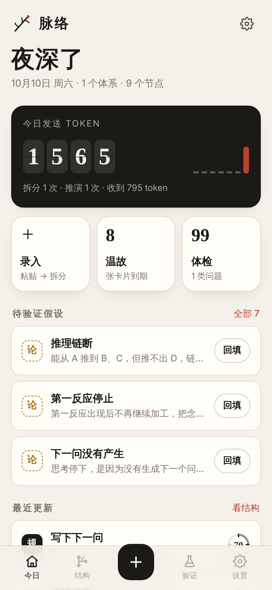 | 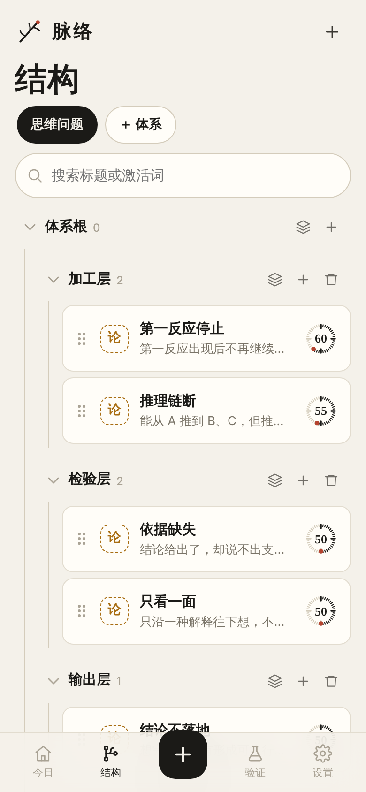 | 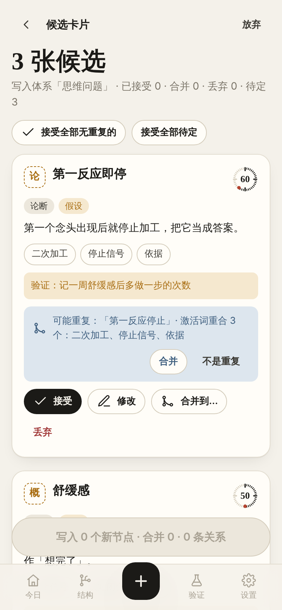 | 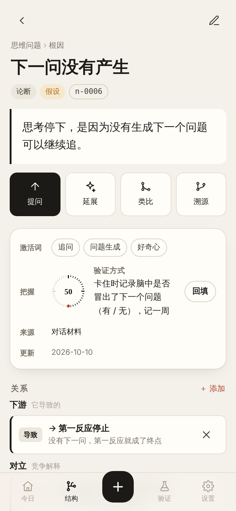 |
| **发送前预览** | **结构先行的回答** | **体检** | **溯源** |
| 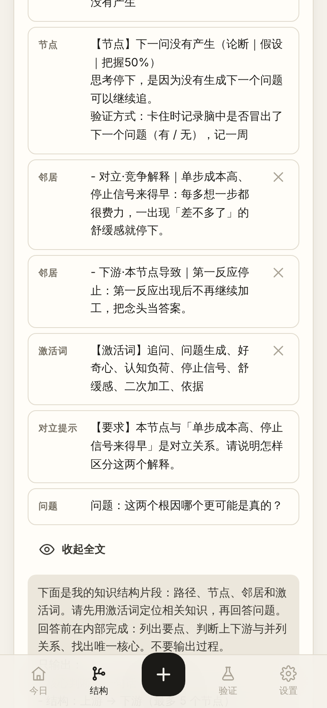 | 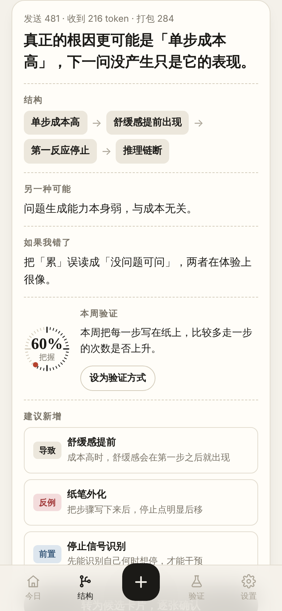 | 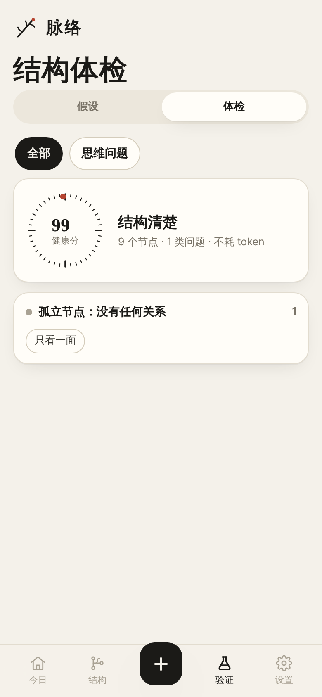 | 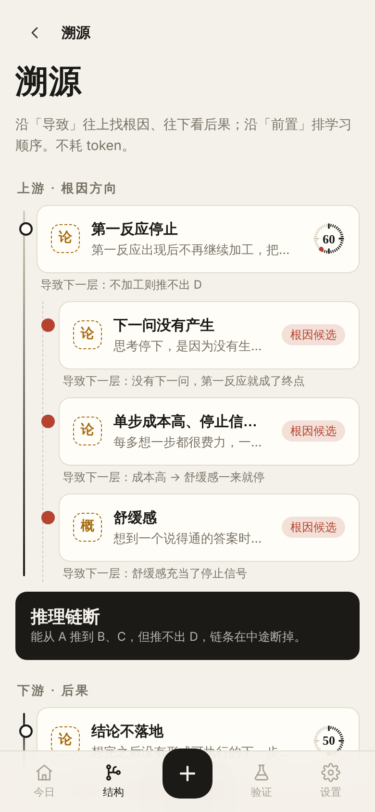 |
| **温故** | **假设与回填** | **深色模式** | **深色 · 回答** |
| 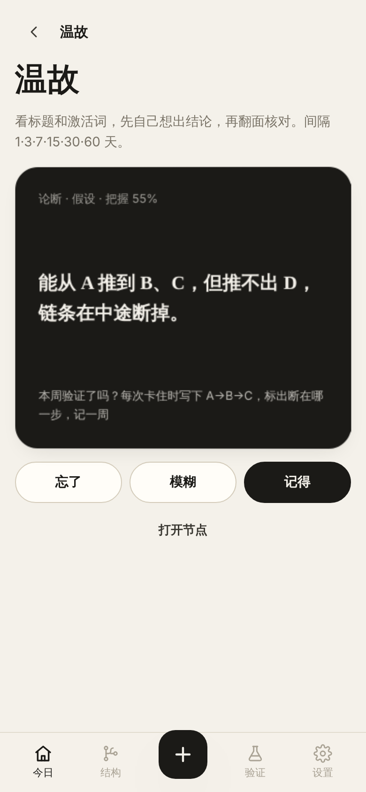 | 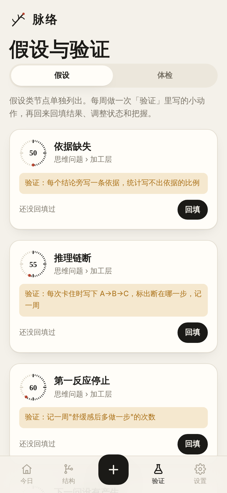 | 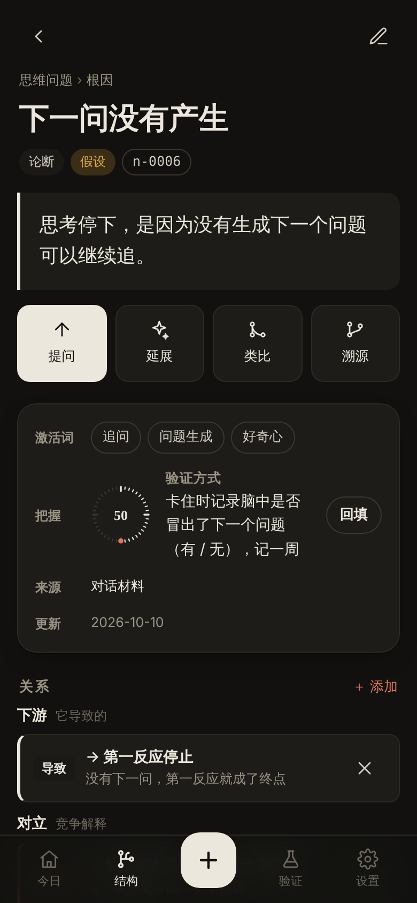 | 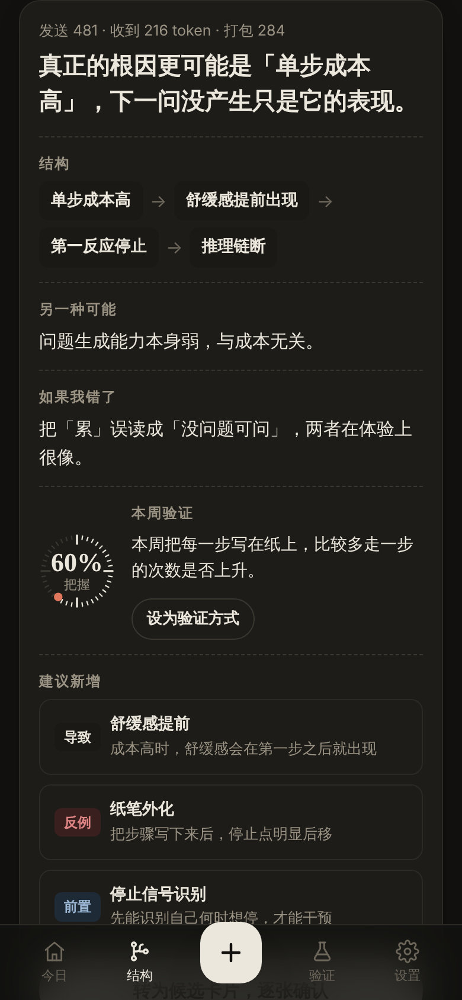 |

---

## 怎么用

### 手机（Android）
1. 打开仓库的 **Actions → 脉络 Android APK**，进入最近一次成功运行，在页面底部的 Artifacts 中下载 `mailuo-debug-apk`，解压后得到 `app-debug.apk`
2. 在手机上安装（需要允许「安装未知来源应用」）
3. 打开后进入「设置」，填写两个模型的地址、模型名和密钥，然后点「测试连接」
4. 回到「今日」，点「载入示例体系」，或者直接点 ＋ 粘贴笔记

知识库保存在手机的 **文档/脉络/** 文件夹里，每个节点是一个 `.md` 文件。用 Obsidian 打开这个文件夹，就能看到同一批笔记的双链和关系图。

### 电脑浏览器（Chrome / Edge）
```bash
cd mailuo
npm run dev          # http://localhost:5178
```
在「设置 → 数据 → 改用本地文件夹」中选择你的 Obsidian 仓库（或其中一个子文件夹），App 会直接读写这些 `.md` 文件。不选文件夹时，数据保存在浏览器里，可以随时「导出 Obsidian 仓库（.zip）」。

### 自己打 APK
需要 JDK 21 和 Android SDK（API 36）：
```bash
cd mailuo && npm ci && npm run android:apk
# 输出：android/app/build/outputs/apk/debug/app-debug.apk
```

---

## 页面清单

| 页面 | 路由 | 做什么 |
|---|---|---|
| 今日 | `#/` | 当日 token 用量（大数字 + 近 7 天柱）、录入 / 温故 / 体检入口、待验证假设、最近更新 |
| 结构 | `#/tree` | 切换体系；层级树可折叠，按住 ⋮⋮ 把节点拖到别的层级即可改父级；新建体系、层级（最多 3 层）、节点；搜索标题和激活词 |
| 录入 | `#/capture` | 选目标体系和来源，粘贴材料，用便宜模型拆分 |
| 候选卡片 | `#/cands` | 每张卡片可以接受、修改、合并到已有节点或丢弃；与已有节点重合度高时提示「可能重复」；候选关系可以开关、调换方向、改类型；只有确认过的内容才写入文件 |
| 节点 | `#/node/:id` | 一句结论、激活词、把握表盘、验证方式；关系视图按上游、下游、支撑、反例、对立、前置、类似、属于分组；结构相似的节点；上次提问 |
| 提问 / 延展 / 类比 | `#/ask/:id` | 打包预览（token 进度条，每项可以 ✕ 删减），发送给旗舰模型，按结构先行格式显示回答；「建议新增」可以转成候选卡片 |
| 溯源 ★ | `#/trace/:id` | 沿「导致」往上找根因、往下看后果，沿「前置」排出学习路线；可以带上因果链提问 |
| 假设 / 体检 ★ | `#/verify` `#/health` | 假设类节点单独列出，可回填验证结果；体检给结构打健康分 |
| 温故 ★ | `#/review` | 翻卡复习，间隔为 1、3、7、15、30、60 天 |
| 设置 | `#/settings` | 两个模型接口分别配置；token 预算；浅色 / 深色；数据位置、导入导出 |

★ 是这次另外设计的三个模块，见下文。

## 数据结构

文件夹就是一个 Obsidian 仓库，层级对应子文件夹：

```
脉络/
├── 思维问题/
│   ├── 思维问题.md                  ← 体系文件（kind: system，记录层级，正文是结构目录，带双链）
│   ├── 加工层/
│   │   ├── 第一反应停止.md          ← 节点文件
│   │   └── 推理链断.md
│   └── 根因/
│       ├── 下一问没有产生.md
│       └── 单步成本高、停止信号来得早.md
└── .mailuo/review.json              ← 温故进度（App 自用）
```

节点文件中，YAML 头的字段和顺序与设计命令一致，另外多了 `checks`（回填记录）和 `created` / `updated`：

```markdown
---
id: n-0001
title: 第一反应停止
type: 论断                      # 概念 / 论断 / 规则 / 问题 / 案例
system: 思维问题
parent: 加工层                  # 层级路径，最多 3 层，如 加工层/二次加工
keywords: [二次加工, 依据, 停止信号]
status: 假设                    # 假设 / 已验证 / 已推翻
confidence: 60
verify: "记一周\"舒缓感后多做一步\"的次数"
source: GPT 总结
links:
  - {type: 导致, to: n-0002, why: 不加工则推不出 D}
checks:
  - {date: 2026-10-10, result: 记录 7 天：多做一步 2 次, status: 假设, confidence: 55}
created: 2026-10-10
updated: 2026-10-10
---
第一反应出现后不再继续加工，把念头当答案。

## 关系
- 导致 [[推理链断]] — 不加工则推不出 D
```

- 关系固定为 7 种：属于、导致、支撑、反例、对立、前置、类似。模型如果输出其他类型，拆分阶段会直接丢掉。
- 「## 关系」这一节根据 YAML 自动生成，所以 Obsidian 关系图能显示连线。节点改名后，指向它的双链会同步更新。
- 密钥和用量账本只存在本机（localStorage），**不写进知识库文件**。

## 模型分工

| 任务 | 接口 | 输出 |
|---|---|---|
| 拆分笔记、打激活词、查重（`merge_into`） | 拆分模型（便宜），默认 DeepSeek | 严格 JSON，提示词 A |
| 提问、延展、类比判断 | 推演模型（旗舰），默认 Claude Opus 5.5 | 结构先行格式，提示词 B |

两个接口都支持 **OpenAI 兼容格式**（DeepSeek、通义、Kimi、OpenRouter……）和 **Anthropic 格式**。每次请求优先按接口返回的 `usage` 记录 token 数，接口没返回时用估算值。

提示词 A、B 与设计命令一致。提示词 B 末尾补了一行，规定「建议新增」的格式为 `关系类型｜标题｜一句结论`，这样回答才能稳定地解析成候选卡片。

### 上下文打包（省 token 的关键）
1. 路径：体系 › 层级 › 节点
2. 节点全文（结论、说明、验证方式）
3. 一跳邻居：每个只发「关系｜标题：一句结论」，按 对立 > 上游导致 > 反例 > 支撑 > 下游导致 > 前置 > 类似 > 属于 排序
4. 涉及节点的激活词合集
5. 节点有对立关系时，自动加一句「请说明怎样区分这两个解释」
6. 问题

默认预算 1500 token。超出时依次：① 砍邻居说明 ② 砍远层路径 ③ 去掉低优先级邻居 ④ 激活词只保留本节点的。**节点本身和问题永远不砍。** 发送前可以预览全文，也可以逐项删减。

---

## 另外设计的三个模块

设计命令里的 5 个模块都做了（模块 4、5 按 v0.1 简化版实现）。另外加了三个**不消耗 token** 的模块，都围绕设计原则「防止把好听的故事当成规则」：

### 1. 体检：结构健康分
扫描整个库，或单个体系，列出会让故事冒充规则的地方，并给出 0–100 的健康分：
- 🔴 假设没写验证方式；假设的把握却 ≥ 85%；关系类型不在 7 种之内；关系指向的节点不存在；对立的两个解释缺少区分方法
- 🟠 已验证但把握 < 50%；假设超过 14 天没回填
- ⚪ 孤立节点；激活词不是 3–5 个；正文超过「一句结论 + 3 行说明」；关系没写理由

点问题下面的节点名，直接跳到对应节点修改。

### 2. 溯源：因果链与学习路线
- 沿「导致」往上递归（最多 4 层）找**根因候选**，往下看后果，画成墨线时间轴
- 算出最长的一条因果链，可以「带上因果链提问」：链上只发标题，几十个 token
- 沿「前置」做拓扑排序，排出**学习路线**：先学什么、后学什么

### 3. 温故：间隔复习
卡片正面是标题和激活词，先自己回想结论，再翻到背面核对。按「忘了 / 模糊 / 记得」安排 1、3、7、15、30、60 天后再复习。假设类节点优先出现，背面会问「本周验证了吗？」。进度保存在 `.mailuo/review.json`，换设备也能接着复习。

## 视觉设计

参考仓库里的 `design/references/ui/` 素材：

| 参考 | 用在哪里 |
|---|---|
| Claude | 暖白纸面背景、衬线大标题、只用一个朱砂色做主动作 |
| stoic | 黑白卡片、三格入口、大号留白、黑色「墨卡」 |
| Prune / GRIS | 品牌标是一条主脉分出侧脉；空状态时枝脉逐笔画出 |
| Mondaine | 「把握」用 40 格刻度表盘表示，朱砂点相当于红色秒针 |
| Fliqlo | 今日 token 用量用翻页数字显示 |
| ClockClock 24 | 等待模型时显示四个双指针小钟，指针错位旋转，并显示计时 |

节点类型用一个字的印章表示（概、论、规、问、例）。假设是琥珀色虚线框，已验证是墨色实心，已推翻加删除线。界面支持跟随系统的深色模式。

---

## 验收（`npm test`，模拟模型，手机尺寸 Chromium）

```
PASS 1000 字材料 1.2 秒内得到候选卡片（< 30 秒）       ← 模拟模型；真实耗时取决于拆分模型
PASS 与已有节点重合时提示「可能重复」
PASS 自造关系类型被过滤
PASS 全部 16 条双链都指向存在的文件
PASS 所有文件的 YAML 头都能被标准解析器读取
PASS 打包内容 333 token（≤ 1500），发送前可预览
PASS 对立关系：自动加入「请说明怎样区分这两个解释」
PASS 推演走旗舰模型，且不发整库
PASS 回答按结构先行格式解析，「建议新增」解析成 3 张候选卡片
PASS 超预算：先砍邻居说明 → 再砍远层路径 → 节点本身永不砍
PASS 拖动改父级：文件移到新层级文件夹
……共 32 项
```

**还没验证的：** 在真机上安装 APK，以及调用真实的模型接口。这里的测试都用模拟接口。Obsidian 这边只验证了双链能对上文件名，YAML 能被标准解析器读取，还没有实际用 Obsidian 打开过。

## 首个试用体系「思维问题」

点「今日 → 载入示例体系」后，会写入：
- 5 个故障节点，分在加工层、检验层、输出层：第一反应停止、推理链断、依据缺失、只看一面、结论不落地。**这几个节点的措辞是占位，请在节点页点「编辑」，换成 GPT 总结的原文。**
- 2 个竞争根因：「下一问没有产生」与「单步成本高、停止信号来得早」，两者互为「对立」，各带一条验证方式

然后对任意一个根因点「提问」，在发送前预览里确认打包内容有多少 token，再检查回答有没有抓住核心。

## v0.1 没做的

云同步、多人协作、全库关系大图、向量检索、AI 自动重组整个知识库、和其他部门 App 互通。这些都按设计命令留到以后。另外注意 Android 11 以上的分区存储：App 能完整读写自己创建的文件，但**在 Obsidian 里新建的文件，App 可能读不到或改不了**（取决于系统版本，还没在真机上验证）。遇到这种情况，可以在电脑上把仓库打成 zip，再用「设置 → 导入 zip」导入。
